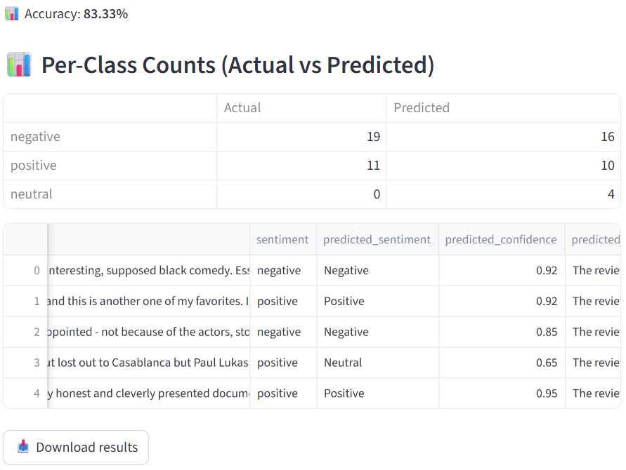
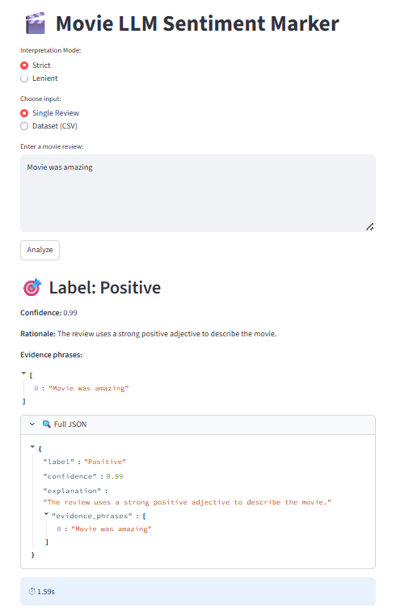

**Prompt Design Choices**

# Schema Enforcement

- The model was explicitly instructed to output a strict JSON object with four keys: label, confidence, explanation, evidence_phrases.

- The schema rules were emphasized to avoid extra text, commentary, or markdown output.

- JSON extraction logic included fallback cleaning to ensure robustness even if the model strayed.

# Few-Shot Examples

The few-shot examples provided a clear mapping of review text to structured JSON outputs. These examples covered:

- Clear Positive → `Loved the soundtrack` → Positive with high confidence.

- Clear Negative → `Terrible pacing…` → Negative with high confidence.

- Mixed (Strict → Neutral) → `Great acting, but the story was boring.` → Balanced, hence Neutral.

- Mixed (Lenient → Positive) → `The cinematography was stunning, though pacing was a bit slow.` → Tilted towards Positive, but mentions weakness.

- Mixed (Lenient → Negative) → `The plot was messy and confusing, though soundtrack was nice.` → Tilted towards Negative, but acknowledges        positives.

- Neutral (Factual) → `The movie releases next week…` → No sentiment, hence Neutral.

These examples ensured the model could generalize beyond clear-cut cases.

# Explicit Rules in Instructions

The prompt instructions contained explicit handling for tricky cases:

- Sarcasm → Ambiguous sarcasm defaults to Neutral in Strict mode.

- Comparisons → Relative tone determines sentiment direction.

- Third-party mentions → Neutral unless explicitly endorsed/criticized.

- Mixed reviews → Strict → Neutral, Lenient → dominant side with weaker side mentioned.

This reduced ambiguity and improved determinism.

# Strict vs Lenient Modes

- Strict Mode → Encourages conservatism, Neutral for balanced/mixed cases.

- Lenient Mode → Picks the stronger polarity, acknowledges weaker side.

Enabled experimentation and improved user control.

# Temperature Control

- Low (0.2) for dataset evaluation → ensures reproducibility and increases accuracy.

- High (0.9) for single review analysis → allows creative and varied phrasing in explanations.

# Failure Cases & Mitigation

- Sarcasm & Humor

    **Example:** “Yeah, that was the best movie ever.” → sometimes misclassified as Positive.

    **Mitigation:** Added explicit sarcasm handling rule (Strict → Neutral).

- Third-party Mentions

    **Example: “Critics say it’s great.”** → initially misclassified as Positive.

    **Mitigation:** Added rule: Neutral unless reviewer endorses or rejects the opinion.

- Mixed Reviews

    **Example: “Great acting, boring story.”** → early versions oscillated between Positive and Negative.

    **Mitigation:** Introduced Strict vs Lenient modes.

- API Rate Limits

    The Gemini 2.5 Flash Lite model enforces a **15 RPM limit**. Processing more than 15 rows originally caused execution failures.  

    **Mitigation:** Introduced a **4.5s delay per review**, ensuring ~13.3 requests/minute `(for randomly selected 30 (or any size) IMDB samples, the processing time varies each time we create dataset with randomly selected samples)` and avoiding rate-limit errors.  
    This allows processing arbitrarily large datasets safely. Latency per review is effectively ~1.19s after accounting for the artificial delay.

- Batch Processing Attempt

    Tried to implement **true batch-level API calls**. However, JSON parsing and schema enforcement became inconsistent in batch responses.  
    This remains a **bottleneck** in the system — future work can focus on improving batch prompts or upgrading to higher RPM models.

# Key Learnings

- Prompt specificity is critical: Clear schema and rules reduce hallucinations.

- Few-shot examples guide behavior: Including mixed/neutral cases was essential for balance.

- Temperature tuning matters: Low temp for reproducibility, high temp for creativity.

- Cache improves performance: Avoided repeated API calls and reduced cost.

- Strict vs Lenient modes add user flexibility and allow handling edge cases differently.

# Detailed metrics (as per 30 sampled reviews) are available in [metrics.csv](./metrics.csv)

# Screenshot is attached rendering the per-class count table, accuracy and final csv in the output (as per 30 sampled reviews): Dataset Mode

# Screenshot is attached rendering the output for Single Review Mode: 

